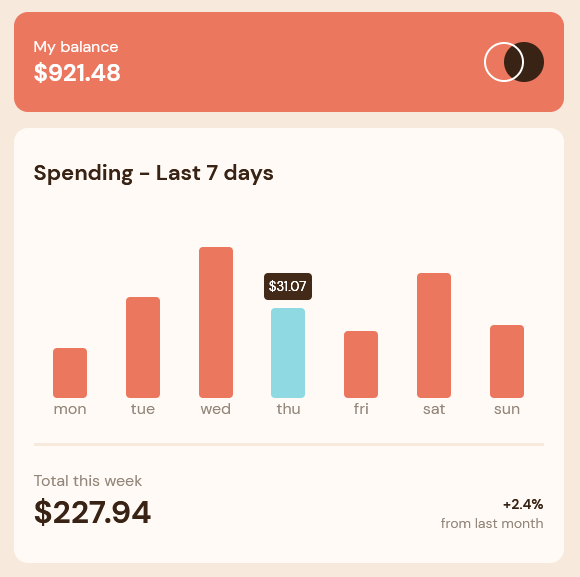

# Frontend Mentor - Expenses chart component solution

This is a solution to the [Expenses chart component challenge on Frontend Mentor](https://www.frontendmentor.io/challenges/expenses-chart-component-e7yJBUdjwt). Frontend Mentor challenges help you improve your coding skills by building realistic projects.

## Table of contents

- [Frontend Mentor - Expenses chart component solution](#frontend-mentor---expenses-chart-component-solution)
  - [Table of contents](#table-of-contents)
  - [Overview](#overview)
    - [The challenge](#the-challenge)
    - [Screenshot](#screenshot)
    - [Links](#links)
  - [My process](#my-process)
    - [Built with](#built-with)
    - [What I learned](#what-i-learned)
    - [Useful resources](#useful-resources)
  - [Author](#author)

## Overview

### The challenge

Users should be able to:

- View the bar chart and hover over the individual bars to see the correct amounts for each day
- See the current day’s bar highlighted in a different colour to the other bars
- View the optimal layout for the content depending on their device’s screen size
- See hover states for all interactive elements on the page
- **Bonus**: Use the JSON data file provided to dynamically size the bars on the chart

### Screenshot

### Links

- Solution URL: [Add solution URL here](https://your-solution-url.com)
- Live Site URL: [Add live site URL here](https://your-live-site-url.com)

## My process

### Built with

- Semantic HTML5 markup
- CSS custom properties
- Flexbox
- CSS Grid
- Mobile-first workflow
- [React](https://reactjs.org/) - JS library
- [Styled Components](https://styled-components.com/) - For styles

### What I learned

This is my second React project so I'm learning it step by step. In this project I used [miragejs](https://miragejs.com/) to create a fake backend to consume the data from JSON file. I want to add it dinamically into the components.
I also improved my knowledge on TypeScript with interfaces and typing.
And of course I also practiced and learned a lot about [styled-components](https://styled-components.com/), sending Props to styled-components to calculate bar heights and also manipulating other elements within an element.

### Useful resources

- [Como criar um tooltip animado...]](https://medium.com/@eduardoqgomes/como-criar-um-tooltip-animado-em-reactjs-com-styled-components-3a75c29db69c) - This taught me how to change properties on different styled-component while making actions in a certain component. I needed it so I could make the hover and click effect on the buttons. Funny how styled-component just solved a problem I was trying to solve with JavaScript. This is a powerfull tool!

## Author

- Frontend Mentor - [@acamposlucas](https://www.frontendmentor.io/profile/acamposlucas)
- Twitter - [@acamposlucas](https://www.twitter.com/acamposlucas)
